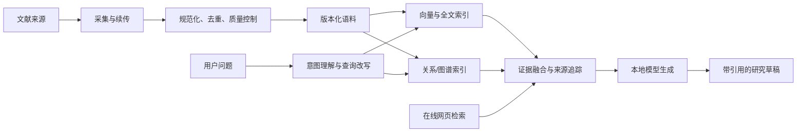

# Literature Research Agent

下载链接：https://1drv.ms/u/c/3bb0ef1668d90ff6/IQCtaPmi3XYTQYLDyZrlNrZzATDN7UqeDKdDI_kHmNuE4ME?e=VQbd2N

面向文献研究流程的本地智能体源码示例。仓库介绍采集、清洗、检索增强、向量索引、模型适配和 Agent 编排之间的关系，重点说明模块边界与数据流。

此仓库刻意不包含访问凭证、具体检索词表、主题配置、研究语料、模型权重或训练产物。它展示系统流程与设计原理，不提供特定研究主题的实操配方。凭证应从运行环境的本地安全配置读取；主题检索式和数据源应由使用者在自己的环境中定义。

## 系统流程

## 目录

- `collection/`：可恢复的采集骨架、字段规范化和去重接口。检索策略仅提供空白占位。
- `RAG/wos_openalex/`：语料准备、全文索引、向量构建、关系索引和检索入口。
- `training/`：监督微调与参数高效适配的训练流程代码；不附训练集或权重。
- `agent/urban_planning_agent/`：Agent、检索器、工具接入和聊天应用组件。
- `packaging/`：Windows 桌面启动入口、PyInstaller 规格和应用依赖示例。
- `config/`：不含凭证的配置模板。
- `docs/`：架构、数据生命周期和训练/评估原则。

## 设计原则

可以在消费级个人电脑运行

采集阶段与分析阶段分离；每次获取记录请求状态和来源元数据，使中断后能够续跑。清洗和去重保留原始记录到规范化记录之间的可追踪关系。索引由可重建语料生成，避免把数据库、向量文件或缓存当作源码提交。

检索阶段分别处理精确文本匹配、向量相似度和文献关系扩展，并将命中的证据、来源标识和置信边界传给生成模型。Agent 负责解释用户意图、选择工具、汇总证据和组织输出；模型输出不取代原文核验。

微调用于学习稳定的任务格式和工作习惯。检索库负责提供可更新事实与来源；训练数据与验证数据应按来源分组隔离，训练前检查泄漏，训练后与未微调基线进行同条件评估。训练适配器、基础模型与部署格式分开管理。

## 凭证与数据保护

所有 API 凭证均由运行环境注入，仓库只提供变量占位符。不要把真实 key、个人配置、请求日志、文献全文、向量库或模型权重提交到 Git。公开分享前检查提交历史和待提交文件；仅从工作树删除凭证并不能清除历史中的凭证。

## 进一步说明

- [系统架构与模块职责](docs/architecture.md)
- [采集、语料与索引生命周期](docs/data-pipeline.md)
- [微调、评估与 Agent 原理](docs/model-agent.md)
- [综述质量控制原则](docs/review-quality.md)

本仓库提供的是可审阅的代码结构。具体依赖版本、数据源许可、查询策略、硬件参数和运行凭证都应由部署方按其目标环境单独决定。
